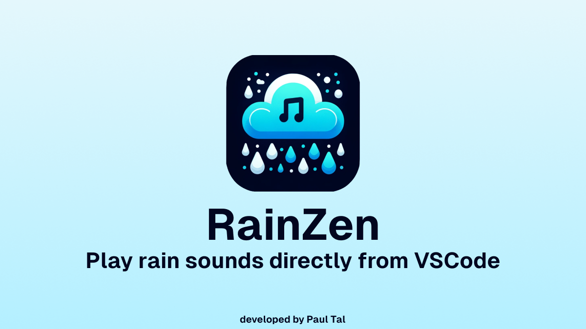
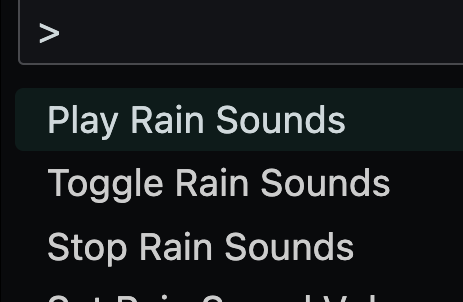
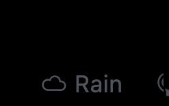
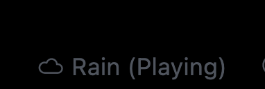

## Extension Description 📖

RainZen is a simple VSCode extension that plays a rain sound in the background. It is meant to be used as a background noise for those who like to work with some ambient noise in the background. The extension is very simple and only plays a single sound file.

## How to use? 🤔

### Use the command palette 🎨

To toggle between the two states you can simply click on the registered status bar toggle or use one of the three commands registered in the command palette.

### Stopped/idle state 🛑

When the status bar toggle containing a `cloud` icon says simply `Rain` the extension is in the idle state. No music is playing.

### Playing state ▶️

When the status bar toggle says `Rain (Playing)` it means that the `sounds/rain1.mp3` file is playing as a child process.

## Support this project 🙏

If you like this project and want to support it, please consider [buying me a coffee](https://www.buymeacoffee.com/katistix). Thank you!
